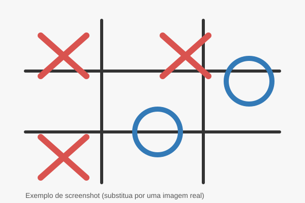

# tic-tac-toe

[](https://github.com/tarcnux/tic-tac-toe)
[](LICENSE)

Jogo da Velha criado pela IA do Coursera.

## Descrição

Este repositório contém uma implementação simples do jogo da velha (tic-tac-toe) em HTML, CSS e JavaScript. A interface permite que duas pessoas joguem no mesmo computador usando o navegador.

> Nota: O projeto foi gerado como parte de um exercício com ferramentas de IA do Coursera.

## Screenshots / Demo

Abaixo há imagens de exemplo (SVGs placeholders). Substitua `assets/screenshot.svg` e `assets/demo-animated.svg` pelos seus screenshots/GIFs reais se preferir.




Se preferir usar um GIF real, coloque o arquivo em `assets/demo.gif` e troque a referência acima por `assets/demo.gif`.

## Como jogar

- Abra o arquivo `index.html` em um navegador moderno (Chrome, Firefox, Edge, Safari).
- Dois jogadores se alternam fazendo as marcações (X e O).
- O objetivo é alinhar três marcas na horizontal, vertical ou diagonal.
- Quando houver um vencedor ou empate, use o botão de reiniciar para jogar novamente (se disponível na interface).

## Executar localmente

1. Clone este repositório:

   git clone https://github.com/tarcnux/tic-tac-toe.git

2. A maneira mais simples é abrir `index.html` no navegador. Se preferir executar um servidor local (útil para desenvolvimento), use um servidor HTTP simples, por exemplo:

   - Com Python 3:
     ```bash
     python3 -m http.server 8000
     ```
     Depois abra http://localhost:8000 no navegador.

   - Com o Node.js (serve):
     ```bash
     npm install -g serve
     serve .
     ```

## Estrutura (exemplo)

Os arquivos principais geralmente incluem:

- `index.html` — página principal do jogo
- `styles.css` ou similar — estilos do jogo
- `script.js` ou similar — lógica em JavaScript

(Os nomes exatos podem variar — verifique a raiz do repositório para os arquivos presentes.)

## Tecnologias

- JavaScript
- HTML
- CSS

## Contribuição

Contribuições são bem-vindas! Se quiser melhorar o projeto, abra uma issue descrevendo a mudança proposta ou envie um pull request com as alterações.

Sugestões de melhorias:

- IA para jogar contra o computador (minimax ou heurística simples)
- Melhorar a interface e animações
- Tests automatizados

## Licença

Nenhuma licença foi especificada neste repositório. Adicione um arquivo `LICENSE` se quiser declarar uma licença (por exemplo, MIT) para permitir uso e contribuições.

## Contato

Criado por tarcnux. Para dúvidas ou sugestões, abra uma issue neste repositório.
